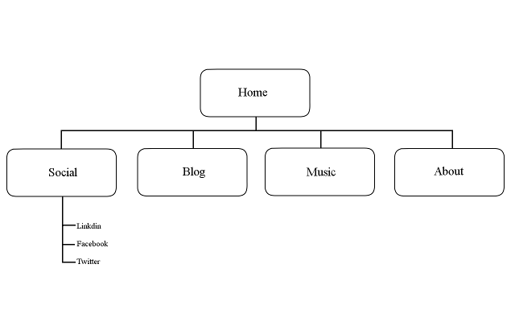

# 2.3 Introduction to Design and Site Planning

## What are the 6 Phases of Web Design?
- Information Gathering: Think about what the site is intended for, what the site is out to achieve, who will be using the website, and what will be contained in the website.
- Planning: Site map
- Design: What will the website look like? How will it function to the user?
- Development: Coding (HTML/CSS)
- Testing and Delivery: Finalize details, code validates, host site
- Maintenance: Keep information up to date, back up data, etc.

## What is your site's primary goal or purpose? What kind of content will your site feature?
My site will be a channel for any creative musings I have. I will post images (preferably original), music (DJ mixes or less known music), long/short blog posts (on any topic I feel inclined to write about) on it.

## What is your target audience's interests and how do you see your site addressing them?
My target audience would be those who look for alternative media, be it different music, art, or ideas. Also, those with similar aesthetice preferences to mine might be attracted to my site. I will try to organize my site with a contemporary and fresh design.

## What is the primary "action" the user should take when coming to your site? Do you want them to search for information, contact you, or see your portfolio? It's ok to have several actions at once, or different actions for different kinds of visitors.
Users will primarily want to search for information and ideas. A secondary action would be finding out about more about me (and potentially services I offer).

## What are the main things someone should know about design and user experience?
Anyone trying to build a website should know that the website is to be designed for the end user. In the end, what the creator or company wants might not be what the user wants. With that, the site is supposed to function well. In my opinion design is nothing without function; if the home page looks beautiful but the site is not organized well, then you have a beautiful but useless site.

## What is user experience design and why is it valuable?
User experience design (UX design) is designing a site to the users' experience, which includes design, accessibility, function, ease of use, psychology, and marketing. You want a website to grab its users so that it can serve its end purpose. UX design is basically a marketing tool to get/maintain traffic to the website, but it is good marketing because it caters to the users wants.

## Which parts of the challenge did you find tedious?
Creating a site map was tedious, just because it is not easy getting everything lined up nicely, which I need to do because I am a very particular person. I didn't find reading through the given material because design is something that intrigues and interests me immensely.
