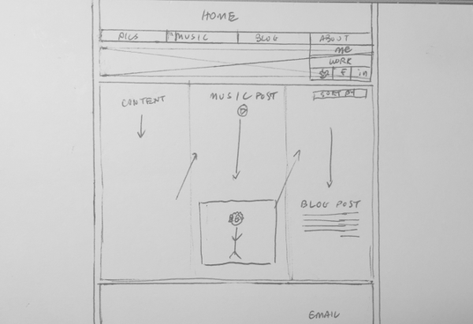

##What is a wireframe?
A wireframe is a simple model of what a website will look like. It should ignore colors and images but give visuals on the layout of the website. In addition to giving a visual layout of the website, a wireframe should also give an idea of how the use will interact with the website.

##What are the benefits of wireframing?
It is good to practice wireframing in the process of building a website, because it allows the designer to focus on how the site will function without thinking about images, colors, fonts, etc. 

##Did you enjoy wireframing your site?
Being pretty design oriented, I did enjoy wireframing. I took a simple approach and took out the ole' pen and paper (4x6 index cards) to sketch out some ideas. I doubt my wireframes are perfect, but for my first time I believe I got the idea right. I see this as good practice for future web design endeavors.

##Did you revise your wireframe or stick with your first idea?
I made some minor revisions on my original idea, mainly within the main body. I tried out different layouts for how content should be displayed.

##What questions did you ask during this challenge? What resources did you find to help you answer them?
I asked myself what some of my favorite sites are (design-wise) and thought about how those sites might be wireframed. This was made easy using the *Wirify by Volkside* tool in Chrome.
  
I also thought about the purpose of wireframes and how detailed they should be. I found various articles about "low-fi", "mid-fi", and "hi-fi" wireframes and in why each one may be favored over the other. 

##Which parts of the challenge did you enjoy and which parts did you find tedious?
I enjoyed sketching out my wireframes. As always for me, reading is tedious. I tend to skim and look for pictures (but I do try reading) to get a basic idea from articles.
