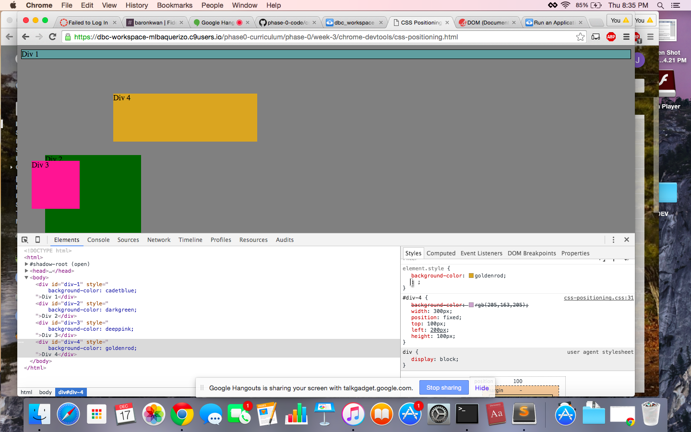
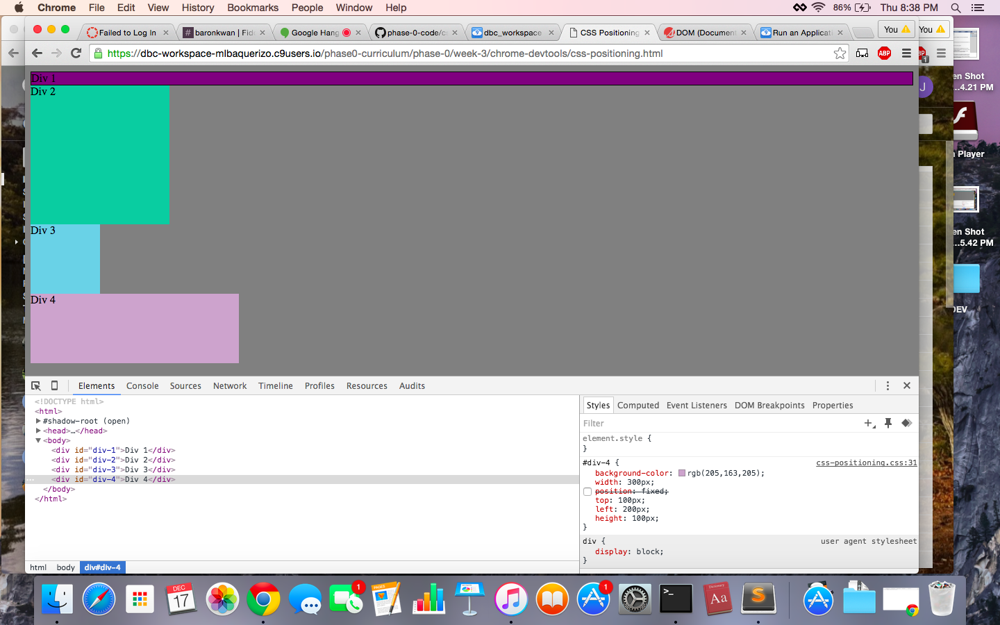
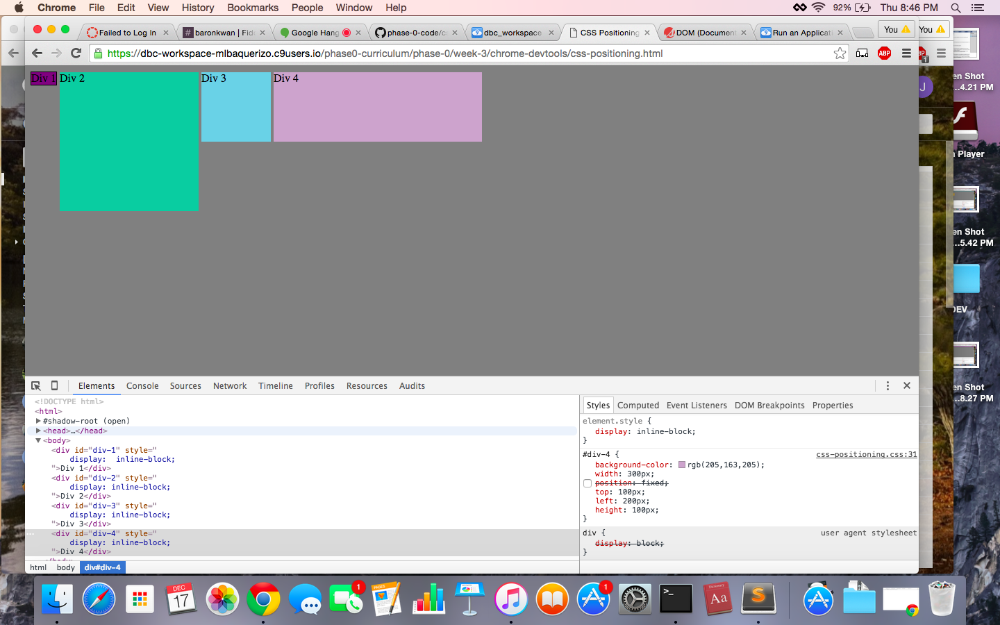
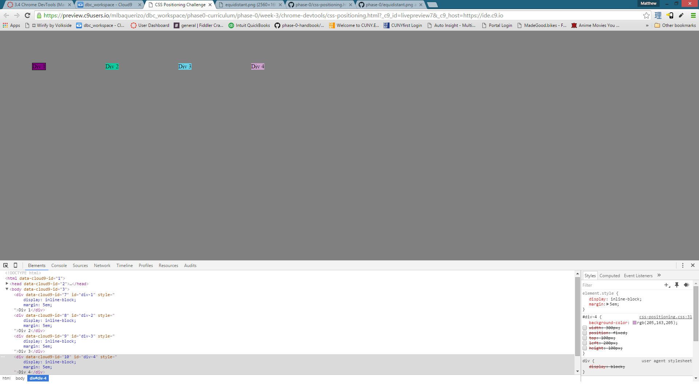
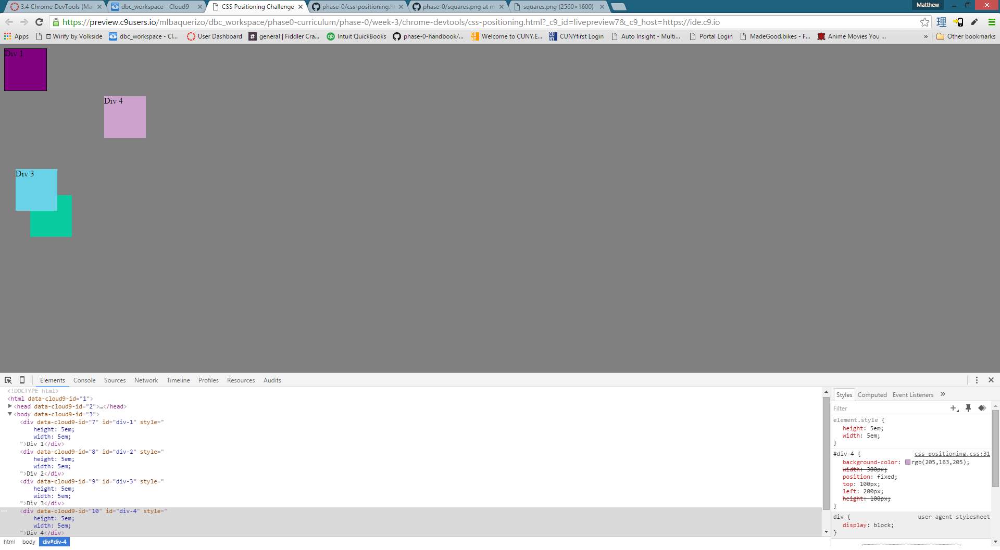
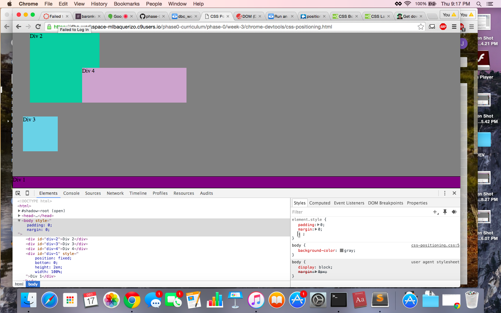
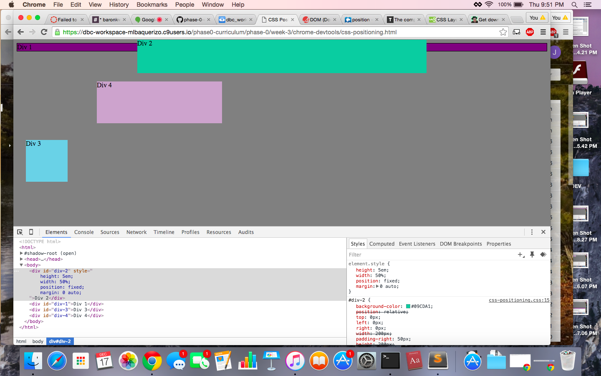
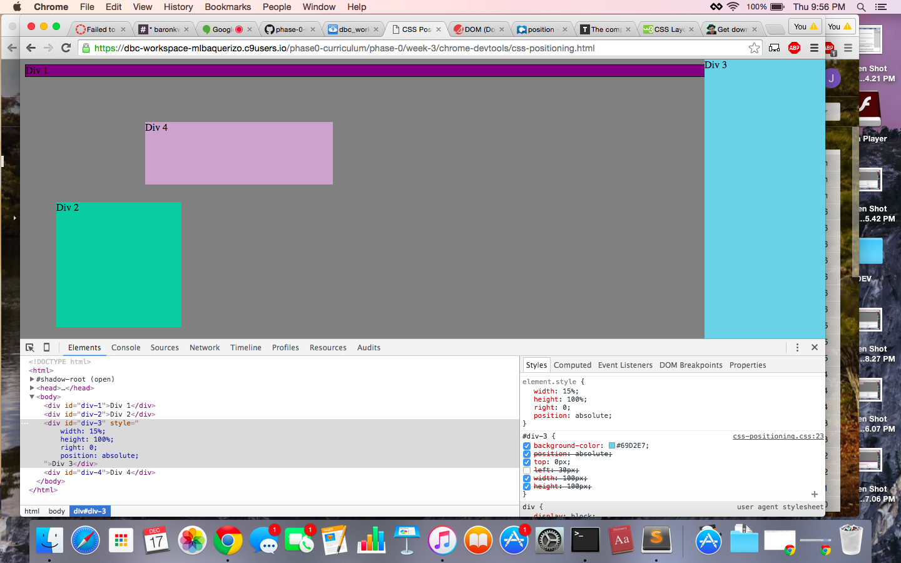
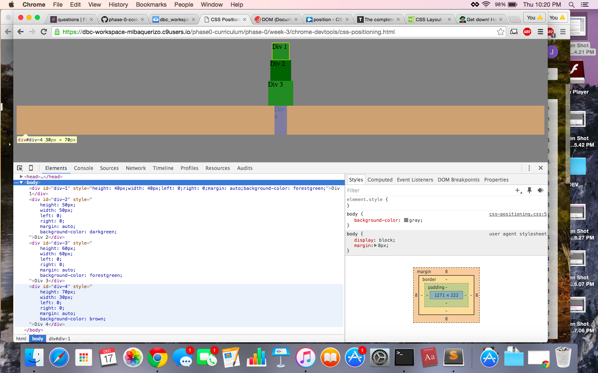

  
  
  
  
  
  
  
  
  
  
  
  
  
  
  
  
  
  
##How can you use Chrome's DevTools inspector to help you format or position elements?
Chrome DevTools is useful for playing around with your current styling and testing different styling options. What makes it great is that you get on the fly changes that you can see in the browser.
  
##How can you resize elements on the DOM using CSS?
Elements on the DOM can be resized with the height/width properties in CSS.
  
##What are the differences between absolute, fixed, static, and relative positioning? Which did you find easiest to use? Which was most difficult?
Static is the default position for an element. Elements are not affected by top, right, bottom, or left properties.  
  
Relative is positioned relative to the static position but can be moved with the top, right, bottom, and left properties. Also, "other elements will not be adjusted to fit into any gaps left by [a relatively positioned element]" --w3schools. I understand this to mean that elements will be slapped on top of relatively positioned elements rather than clear them.
  
Absolute
  
Fixed
  
  
##What are the differences between margin, border, and padding?

  
##What was your impression of this challenge overall? (love, hate, and why?)
