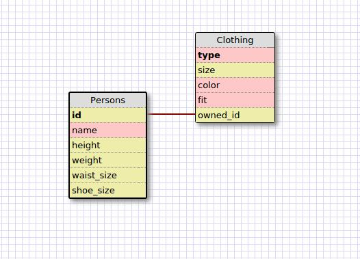

### 1. Select all data for all states.
SELECT * FROM states;

### 2. Select all data for all regions.
SELECT * FROM regions;

### 3. Select the state_name and population for all states.
SELECT state_name, population FROM states;

### 4. Select the state_name and population for all states ordered by population. The state with the highest population should be at the top.
SELECT state_name, population
FROM states
ORDER BY population DESC;

### 5. Select the state_name for the states in region 7.
SELECT state_name FROM states WHERE region_id = 7;

### 6. Select the state_name and population for states with a population density over 50 ordered from least to most dense.
SELECT state_name, population_density FROM states
WHERE population_density > 50
ORDER BY population_density ASC;

### 7. Select the state_name for states with a population between 1 million and 1.5 million people.
SELECT state_name FROM states
WHERE population > 1000000 AND population < 1500000;

### 8. Select the state_name and region_id for states ordered by region in ascending order.
SELECT state_name, region_id FROM states
ORDER BY region_id ASC;

### 9.Select the region_name for the regions with "Central" in the name.
SELECT region_name FROM regions
WHERE region_name LIKE "%Central";

### 10. Select the region_name and the state_name for all states in ascending order by region_id. Refer to the region by name. (This will involve joining the tables).
SELECT regions.region_name, states.state_name
FROM regions
JOIN states ON regions.id = states.region_id
ORDER BY states.region_id ASC;

### Reflection:
#### What are databases for?
Databases are a reliable, secure, and organized way to store quantitative or qualitative data. With SQL it is easy to link data together to find correlations between different data types. This is particularly useful for large amounts of data, which can be manipulated with simple commands.

#### What is a one-to-many relationship?
A one-to-many relationship is one in which a single "object" or instance of a data type (entity) can own or map to many instances of another entity. For example, two entities - People, Cars. One instance of People (one person) may own several cars.

#### What is a primary key? What is a foreign key? How can you determine which is which?
A primary key in a data set fills 3 criteria: Each key is unique to each instance, every instance has a key, and every key is distinct. A foreign key in a data set identifies if the instance it belongs to matches up with a primary key of another set of data. These do not need to be unique or distinct. For example, A person's ID can match up to one car ID or many car IDs. The person's ID in this case would be a primary key and the car ID would be the foreign key.

#### How can you select information out of a SQL database? What are some general guidelines for that?
You would use the form: SELECT (data) FROM (database);
You can get more or less specific as to what data you choose and how it is sorted. Various SQL commands include:
ORDER BY (data) (ASC, DESC)-- sort data in ascending or descending order.
WHERE (data) (=, >, <, >=, <=, !=) (quantity, quality) -- Choose specific data.