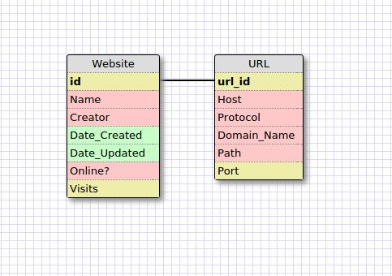
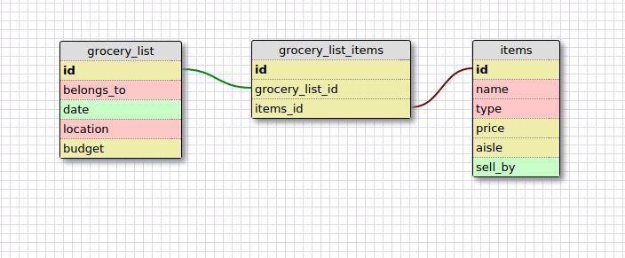

This relationship between a website and url is one-to-one because a website can have just one URL and a URL can belong to just one website. The website and URL are joined simply by an ID. They can be separate entities since the website may have many other properties and the URL may also have its own properties, and having them as separate entities makes the data cleaner to look at and easier to be run through.

##Reflection
#### What is a one-to-one database?
A one-to-one database is one in which instances of a entity are related to one instance of another entity, and vice-versa. For example, one country can have one capital city, and only one city in a country can be the capital of that country.

#### When would you use a one-to-one database?
One-to-one databases are useful when we want to separate specific data from an entity with a large amount of properties (columns). In these situations, we would create a new entity by splicing off the desired properties and having those properties contain the same data. The two entities could then be joined by some ID and the desired data is now more easily and efficiently accessed.

#### What is a many-to-many database?
A many-to-many database is one in which there are two entities, A and B, such that an instance of A can be related to many instances of B; and an instance of B can be related to many instances of A.

#### When would you use a many-to-many database?
A many-to-many database would be used when we need to express instances of one entity as being able to contain many instances of another and vice versa.

#### What is confusing about database schemas? What makes sense?
I think the various relationships (one-to-many, one-to-one, many-to-many) are easy to understand conceptually, but putting them into practical use is more difficult to do. It seems that one-to-many relationships are going to be used more often the one-to-one or many-to-many relationships as I am having trouble thinking of situations in which the latter two would be useful.